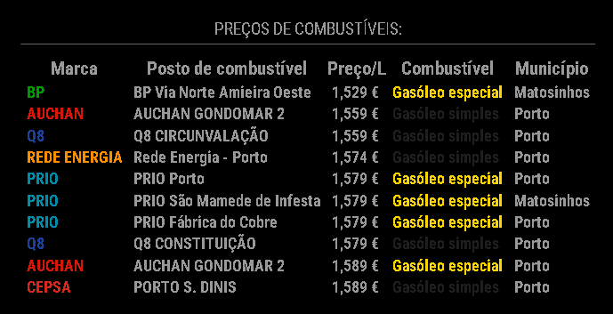

<div align=center>
  
  # MMM-GasPricesPT 
  
  [](https://raw.githubusercontent.com/Fneves7/MMM-GasPricesPT/main/LICENSE)
  
  
  
  This is a module to display a list of the cheapest gas prices in Portugal by district and county for [MagicMirror²](https://github.com/MichMich/MagicMirror).
  
  
</div>

## Installation
1. Change directory to "path/MagicMirror/modules".
2. `git clone https://github.com/Fneves7/MMM-GasPricesPT`.
3. Add your configuration on `config.js`.

## Configuration example:

```js
{
  module: "MMM-GasPricesPT",
  position: "bottom_center",
  config: {
      showFuelBrand: true,
      showGasStationName: true,
      showPrice: true,
      showFuelType: true,
      showDistrict: true,
      showCounty: true,
      showUpdatedAt: false,         
      district: "Porto",
      county: 
      {
          "1": "Porto",
          "2": "Matosinhos"
      },
      brand: null,
      fuelTypes:
      {
          "1": "Diesel",
          "2": "Diesel Aditivado"

      },
      gasStationType: null,
      rowLimit: 10
  }
},
```

### Important notes:
1. The fields "district", "county", "brand", "fuelTypes" and "gasStationType" are case sensitive. Make sure that they're written properly, you can find the correct description below this README file or use the find function of your brower.
2. Do not put counties that does not belong to that district and vice versa, it will blow the API (ex: districy:"Porto" county:"Óbidos").
3. If the module does not show on your MagicMirror, you have messed with the configuration file, check the values if is missing some accentuation in disctrics or counties.

### Field Options:
#### Here you can find the values to fill on your configuration file, feel free to copy paste.

GasStation Types (gasStationType):
  * Auto-estrada
  * Área-comercial
  * Outro

Fuel Types (fuelTypes):
  * GPL
  * GNC
  * GNL
  * GNC
  * Diesel
  * Diesel Aditivado
  * Biodiesel
  * Diesel Colorido
  * Diesel Aquecimento
  * Gasolina 95
  * Gasolina 95 Aditivada
  * Gasolina Mistura
  * Gasolina 98
  * Gasolina 98 Aditivada

FuelBrands (brand):
  * AGIP 
  * ALVES BANDEIRA 
  * ANIBAL ANTUNES BANDEIRA 
  * ATLANTIC OIL 
  * AUCHAN 
  * AUTO JULIO 
  * AVIA 
  * AZORIA 
  * BEQ 
  * BOMBAGÁS
  * BP
  * BXPRESS
  * CARLOS BALTAZAR
  * CARRASQUINHO & FILHOS
  * CEPSA
  * CIDADE N ALDEIA
  * CIPOL
  * CONTINENTE
  * CREIXOAUTO
  * DOUROGAS NATURAL
  * DPC
  * DPP
  * ECOBRENT
  * ECOMARCHÉ
  * ESSO
  * ETC
  * FREITAS
  * FUELTEJO
  * GALP
  * GAPOR
  * GASOLAR
  * GASPE
  * GASPROCAR
  * G-ENERGY
  * Genérico
  * GOTA
  * ILÍDIO MOTA
  * INTERMARCHÉ
  * JUMBO
  * LECLERC
  * LUBRIDÃO
  * LUSIADAGÁS
  * OFIMAQ
  * OLEOFAT
  * OZ Energia
  * PETRIN
  * PETRO BASTO
  * PETROALVA
  * PETROIBÉRICA
  * PETROVARIANTE
  * PETROVAZ
  * PINGO DOCE
  * PRIO
  * Q8
  * RECHEIO
  * REDE ENERGIA
  * REDIL
  * REPSOL
  * SCAM
  * SHELL
  * SOPOR
  * TFUEL
  * TRANSFORPEL
  * TRAVESSO
  * TUACAR
  * VIBAGÁS
  * FG COMBUSTÍVEIS
  * VALCARCE
  * VIA
  * PRONTO 

District (district):
  * Aveiro 
  * Beja 
  * Braga 
  * Bragança 
  * Castelo Branco 
  * Coimbra 
  * Évora 
  * Faro 
  * Guarda 
  * Leiria
  * Lisboa
  * Portalegre
  * Porto
  * Santarém
  * Setúbal
  * Viana do Castelo
  * Vila Real
  * Viseu 

County (county):
  * Vouzela 
  * Vizela
  * Viseu 
  * Vinhais
  * Vimioso
  * Vila Viçosa 
  * Vila Verde
  * Vila Velha de Ródão
  * Vila Real de Santo António 
  * Vila Real 
  * Vila Pouca de Aguiar 
  * Vila Nova de Poiares
  * Vila Nova de Paiva 
  * Vila Nova de Gaia 
  * Vila Nova de Foz Côa 
  * Vila Nova de Famalicão
  * Vila Nova de Cerveira 
  * Vila Nova da Barquinha 
  * Vila Franca de Xira 
  * Vila Flor
  * Vila do Conde 
  * Vila do Bispo 
  * Vila de Rei
  * Vieira do Minho
  * Vidigueira
  * Viana do Castelo 
  * Viana do Alentejo 
  * Vendas Novas 
  * Valpaços 
  * Valongo 
  * Valença 
  * Vale de Cambra
  * Vagos
  * Trofa 
  * Trancoso 
  * Torres Vedras 
  * Torres Novas 
  * Torre de Moncorvo
  * Tondela 
  * Tomar 
  * Terras de Bouro
  * Tavira 
  * Tarouca 
  * Tabuaço 
  * Tábua
  * Sousel 
  * Soure
  * Sobral de Monte Agraço 
  * Sintra 
  * Sines 
  * Silves 
  * Sever do Vouga
  * Setúbal 
  * Sesimbra 
  * Sertã
  * Serpa
  * Sernancelhe 
  * Seixal 
  * Seia 
  * Sátão 
  * Sardoal 
  * São Pedro do Sul 
  * São João da Pesqueira 
  * São João da Madeira
  * São Brás de Alportel 
  * Santo Tirso 
  * Santiago do Cacém 
  * Santarém 
  * Santa Marta de Penaguião 
  * Santa Maria da Feira
  * Santa Comba Dão 
  * Salvaterra de Magos 
  * Sabugal 
  * Sabrosa 
  * Rio Maior 
  * Ribeira de Pena 
  * Resende 
  * Reguengos de Monsaraz 
  * Redondo
  * Proença-a-Nova
  * Póvoa de Varzim 
  * Póvoa de Lanhoso
  * Porto de Mós 
  * Porto 
  * Portimão 
  * Portel
  * Portalegre 
  * Ponte de Sor 
  * Ponte de Lima 
  * Ponte da Barca 
  * Pombal 
  * Pinhel 
  * Peso da Régua 
  * Peniche 
  * Penela
  * Penedono 
  * Penamacor
  * Penalva do Castelo 
  * Penafiel 
  * Penacova
  * Pedrógão Grande 
  * Paredes de Coura 
  * Paredes 
  * Pampilhosa da Serra
  * Palmela 
  * Paços de Ferreira 
  * Ovar
  * Ourique
  * Ourém 
  * Oliveira do Hospital
  * Oliveira do Bairro
  * Oliveira de Frades 
  * Oliveira de Azeméis
  * Olhão 
  * Oleiros
  * Oeiras 
  * Odivelas 
  * Odemira
  * Óbidos 
  * Nisa 
  * Nelas 
  * Nazaré 
  * Murtosa
  * Murça 
  * Mourão
  * Moura
  * Mortágua 
  * Mora
  * Montijo 
  * Montemor-o-Velho
  * Montemor-o-Novo
  * Montalegre 
  * Monforte 
  * Mondim de Basto 
  * Monchique 
  * Monção 
  * Moita 
  * Moimenta da Beira 
  * Mogadouro
  * Mirandela
  * Miranda do Douro
  * Miranda do Corvo
  * Mira
  * Mesão Frio 
  * Mértola
  * Melgao 
  * Melgaço 
  * Meda 
  * Mealhada
  * Matosinhos 
  * Marvão 
  * Marinha Grande 
  * Marco de Canaveses 
  * Manteigas 
  * Mangualde 
  * Maia 
  * Mafra 
  * Macedo de Cavaleiros
  * Mação 
  * Lousada 
  * Lousã
  * Lourinhã 
  * Loures 
  * Loulé 
  * Lisboa 
  * Leiria 
  * Lamego 
  * Lagos 
  * Lagoa 
  * Ílhavo 
  * Idanha-a-Nova
  * Guimares
  * Guimarães
  * Guarda 
  * Grândola 
  * Gouveia 
  * Gondomar 
  * Golegã 
  * Góis
  * Gavião 
  * Fundão
  * Fronteira 
  * Freixo de Espada à Cinta
  * Fornos de Algodres 
  * Figueiró dos Vinhos 
  * Figueira de Castelo Rodrigo 
  * Figueira da Foz
  * Ferreira do Zêzere 
  * Ferreira do Alentejo
  * Felgueiras 
  * Faro 
  * Fafe
  * Évora
  * Estremoz
  * Estarreja 
  * Esposende
  * Espinho 
  * Entroncamento 
  * Elvas 
  * Cuba
  * Crato 
  * Covilhã
  * Coruche 
  * Constância 
  * Condeixa-a-Nova
  * Coimbra
  * Cinfães 
  * Chaves 
  * Chamusca 
  * Celorico de Basto
  * Celorico da Beira 
  * Castro Verde
  * Castro Marim 
  * Castro Daire 
  * Castelo de Vide 
  * Castelo de Paiva 
  * Castelo Branco
  * Castanheira de Pêra 
  * Cascais 
  * Cartaxo 
  * Carregal do Sal 
  * Carrazeda de Ansiães
  * Cantanhede
  * Campo Maior 
  * Caminha 
  * Caldas da Rainha 
  * Cadaval 
  * Cabeceiras de Basto
  * Bragança
  * Braga
  * Boticas 
  * Borba
  * Bombarral 
  * Benavente 
  * Belmonte
  * Beja
  * Batalha 
  * Barreiro 
  * Barrancos
  * Barcelos
  * Baião 
  * Azambuja 
  * Avis 
  * Aveiro 
  * Arruda dos Vinhos 
  * Arronches 
  * Arraiolos
  * Arouca 
  * Armamar 
  * Arganil
  * Arcos de Valdevez 
  * Ansião 
  * Anadia 
  * Amares
  * Amarante 
  * Amadora 
  * Alvito
  * Alvaiázere 
  * Alter do Chão 
  * Alpiarça 
  * Almodôvar
  * Almeirim 
  * Almeida 
  * Almada 
  * Aljustrel
  * Aljezur 
  * Alijó 
  * Alfândega da Fé
  * Alenquer 
  * Alcoutim 
  * Alcochete 
  * Alcobaça 
  * Alcanena 
  * Alcácer do Sal 
  * Albufeira 
  * Albergaria-a-Velha 
  * Alandroal
  * Aguiar da Beira 
  * Águeda 
  * Abrantes
